# Lab 5: Configure and Execute Full Stack Backup Recovery

## Introduction

In this lab, use the supplied configuration script to configure OCI Full Stack Backup Recovery (Full Stack BR) for protected resources in the Ashburn region. Full Stack BR protects two compute virtual machines and an individual volume group for each VM within one region.

The synthetic AI workload runs on both compute VMs as a scheduler. It continuously updates a counter by completing one job every minute. Record the counter value before and after Full Stack BR operations and use it to observe workload continuity during backup and recovery testing.

At a high level, the configuration script creates the backup policy and Full Stack BR protection group, adds the compute and volume group members, and activates protection. You then use the OCI Console to create or review member backups, create a recovery point from the Recovery Catalog, and use a Full Stack BR plan to recover a protected compute resource.

**Before you begin:** Complete Lab 3 Task 2 and start the Start Drill execution. Then begin Lab 5 while the DR execution runs.

Complete the Full Stack BR activities while the DR execution runs. Start Lab 4 only after Lab 3 completes successfully.

Estimated Time: 20 minutes

### Objectives

In this lab, you will:

- Record the synthetic AI workload baseline and monitor the job counters throughout the backup and recovery activities.
- Run the Full Stack BR configuration script.
- Review the Ashburn Full Stack BR protection group and its protected members.
- Review the default backup plan and its plan groups.
- Review the catalog and Full Stack BR point.
- Run a backup or recovery plan and verify its execution.

## Task 1: Record the Synthetic AI Workload Baseline

1. In the **Ashburn** region, open the OCI Console navigation menu and select **Compute**, then **Instances**. In the compartment assigned to you, locate these two compute instances:

    - `fsr-rag-recovery-vm-0`
    - `fsr-rag-recovery-vm-1`

    Open each instance and copy its **Public IP address**.

    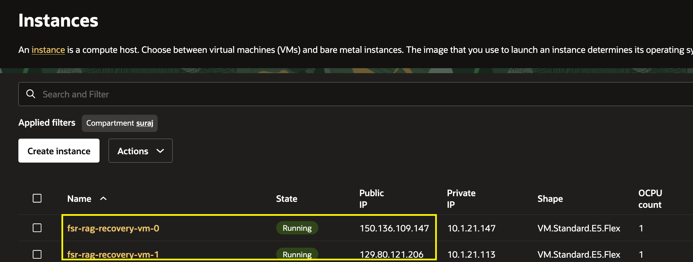

2. In separate browser tabs, open `http://<public-ip-1>` for VM 0 and `http://<public-ip-2>` for VM 1. Use the first tab to monitor VM 0 and the second tab to monitor VM 1. Record the number of completed AI jobs shown by the synthetic AI workload on each VM. These values are the baseline for the Full Stack BR backup and recovery validation. Keep both tabs open throughout Lab 5 and return to them at each major Full Stack BR milestone to record the updated counters.

    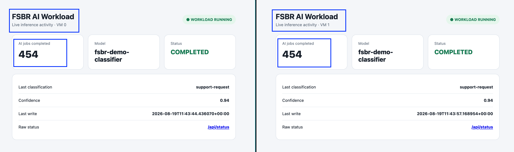

## Task 2: Configure Full Stack BR

1. In the Ashburn Cloud Shell, change to the application directory created in Lab 1.

    Run:

    ```bash
    <copy>
    cd ~/oci-ai-resiliency-lab
    </copy>
    ```

2. Review the Full Stack BR configuration flow before you run the wrapper. Unlike the interactive Full Stack DR configuration in Lab 2, this Full Stack BR configuration runs without confirmation prompts. Allow each phase to complete and monitor the timestamped progress messages. The script performs these actions in order:

    - Creates or verifies the Full Stack BR log bucket and creates the backup policy.
    - Creates the Full Stack BR protection group.
    - Adds the individual volume group and compute-instance members for both VMs.
    - Activates the Full Stack BR protection group.
    - Provisions or refreshes the default and user-defined Full Stack BR plans and enables scheduled backups.

3. Run the Full Stack BR configuration wrapper:

    ```bash
    <copy>
    ./scripts/configure-fsbr-vm-vg.sh
    </copy>
    ```

    The script displays its inputs, creates or verifies the log bucket, prepares the individual volume groups, and begins creating the Full Stack BR backup policy and protection group.

    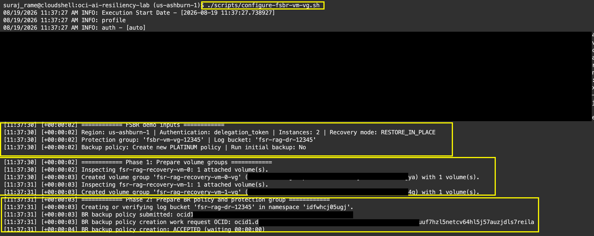

    As the script progresses, it creates the Full Stack BR protection group and adds the four members: two compute instances and their two individual volume groups.

    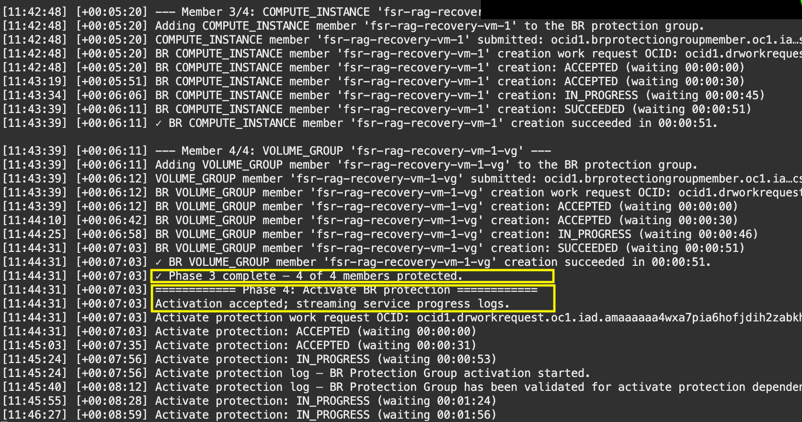

    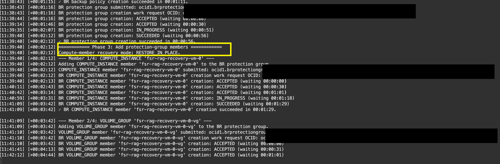

    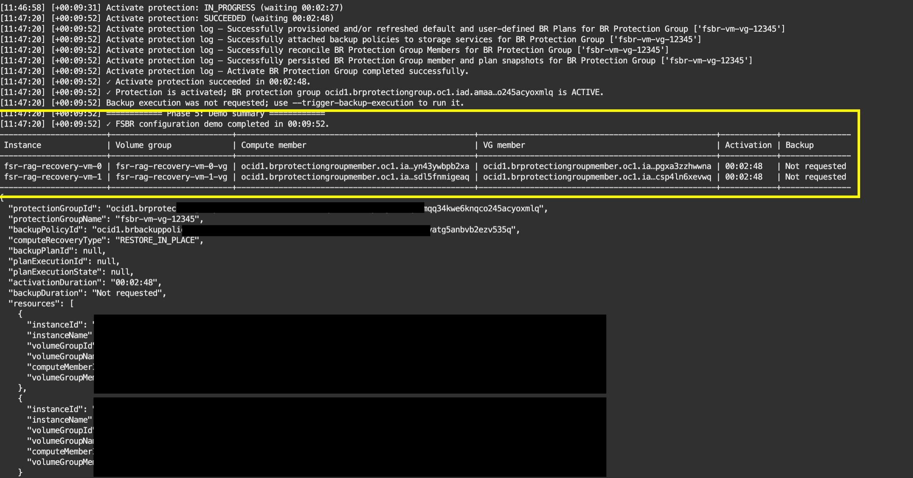

4. Monitor the script output until it returns successfully. Record the Full Stack BR protection group, backup policy, plan, and execution identifiers that it reports. You will create or review member backups, recovery points, and recovery-plan executions in the OCI Console in the following tasks.

## Task 3: Review the Full Stack BR Protection Group

1. In the Ashburn OCI Console, open the navigation menu and select **Migration & Recovery**, then **Backup Recovery**.

    Confirm that the **Backup Recovery** protection-group page is open and that the Full Stack BR protection group created by the script appears in the assigned compartment. Its name follows the pattern `fsbr-vm-vg-xxxxx`, where `xxxxx` is generated for your environment.

    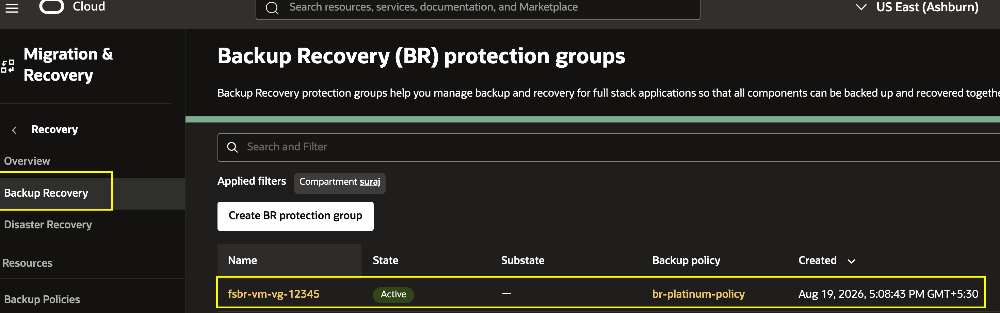

2. Select the compartment used for the workshop and open the Full Stack BR protection group created by the script.

3. Open the **Members** tab. Confirm that the protection group contains:

    - Compute VM 1.
    - Compute VM 2.
    - The individual volume group attached to each compute instance.

    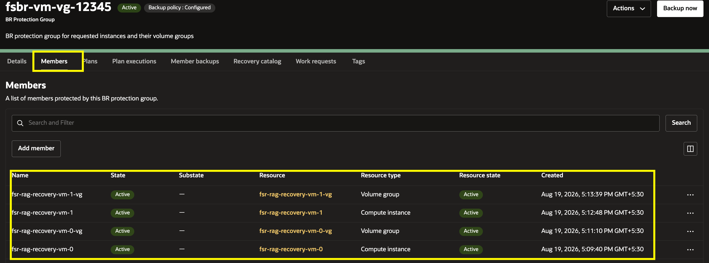

    The protection group defines the single-region Ashburn protection boundary. Each volume group protects the application storage used by its associated compute member.

4. Confirm that the member resources are available and that each volume group is associated with its expected compute instance. Record any member or association warning before continuing.

## Task 4: Review the Default Backup Plan and Run a Full Stack BR Backup

1. Open the **Plans** tab for the Full Stack BR protection group. Confirm that the default backup and recovery plans are present and in the **Active** state.

    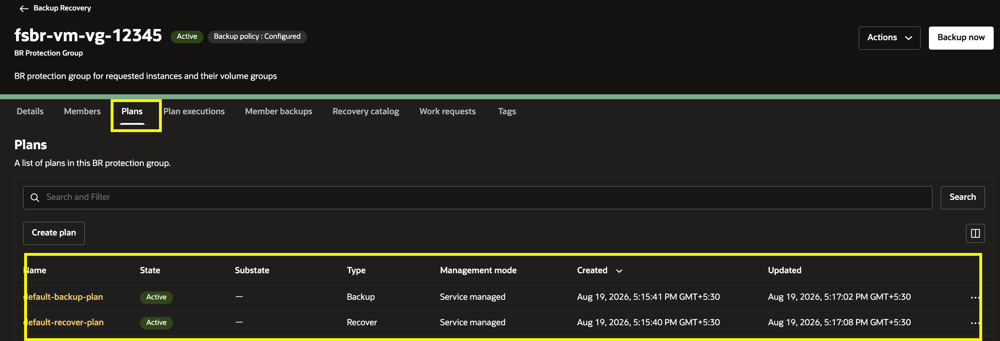

2. Open **default-backup-plan** and select the **Plan groups** tab. Review the plan groups, including the prechecks, volume-group backup, and compute-instance backup groups.

    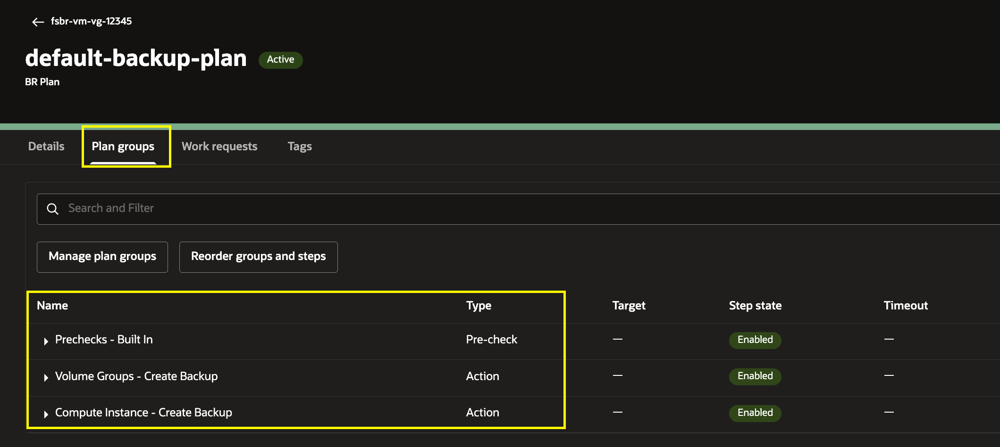

3. Before running the backup plan, return to the two workload tabs and record the current **AI jobs completed** value from VM 0 and VM 1. Keep these values as the pre-backup baseline for comparison after the backup and restore operations.

    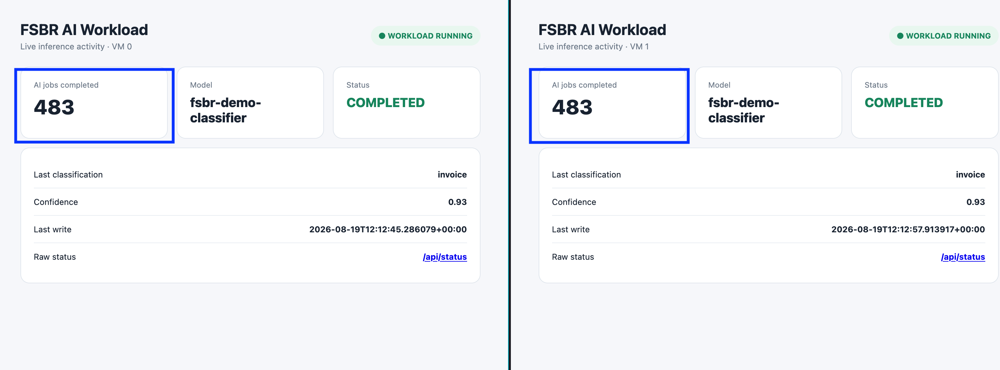

4. On the **default-backup-plan** page, open **Actions** and select **Execute plan**. Confirm the execution to start the backup plan.

    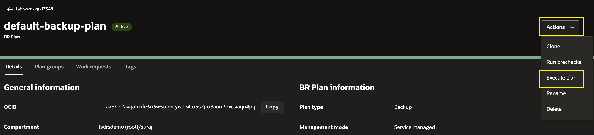

    In the execution form, enter a name such as `First backup`, leave prechecks enabled, and select **Execute plan**.

    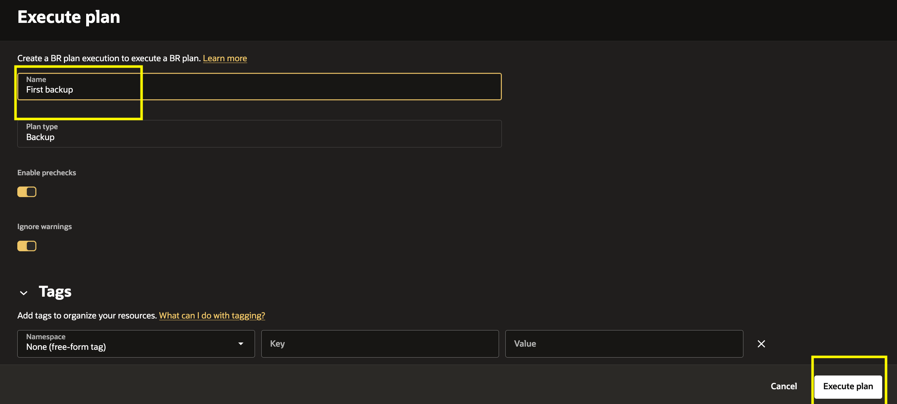

5. Open the execution details and monitor each plan group. Review task status, logs, warnings, and failures as the execution progresses.

6. Wait for the execution to complete successfully. Record the Full Stack BR point identifier or execution identifier. Then return to the two workload tabs and record the updated **AI jobs completed** value from VM 0 and VM 1. Compare the values with the pre-backup baseline.

    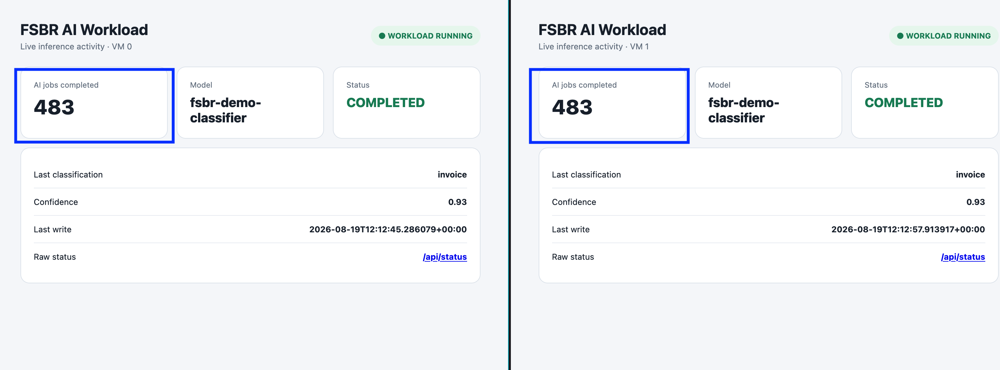

## Task 5: Create and Review a Full Stack BR Point

1. Open the **Catalog** or **Full Stack BR Points** tab for the protection group.

2. Review the available member backups. Confirm that the catalog lists backups for both compute instances and both volume groups.

3. Select the Full Stack BR point created by the completed Task 4 backup execution. Confirm its creation time, protected members, and status.

    A Full Stack BR point represents a consistent recovery point assembled from the protected member backups. Use a completed Full Stack BR point for recovery operations.

4. Confirm that the protected members remain associated with the Full Stack BR protection group.

## Conclusion

You have completed **Build and Test Resiliency for AI Workloads with OCI Full Stack Disaster Recovery**. You configured and tested cross-region recovery with Full Stack DR. You then used Full Stack BR to protect and recover the Ashburn compute instances and their individual volume groups.

Together, OCI Full Stack DR and OCI Full Stack BR help you protect, recover, and validate the infrastructure, data, and application services that support a resilient AI workload.

## Acknowledgements

* **Author** - Suraj Ramesh, Lead Principal Product Manager, Oracle Database High Availability (HA), Scalability and Maximum Availability Architecture (MAA)
* **Last Updated By/Date** - August 2026
