# Lab 2: Configure Full Stack DR for the AI Workload

## Introduction

Configure Full Stack DR for the AI application from Lab 1. Keep the original Ashburn Cloud Shell session available. The configuration creates DR Protection Groups and DR plans for the primary and standby regions. It configures the Autonomous AI Database as a snapshot standby for DR Drill operations.

Run the commands from the Ashburn Cloud Shell used in Lab 1.

**Before you begin:** Complete Lab 1 and keep the original Ashburn Cloud Shell session available.

The AI application runs in the Kubernetes namespace `ai-fsdr-lab`. Full Stack DR protects and restores the OKE resources in this namespace.

Estimated Time: 15 minutes

### Objectives

In this lab, you will:

- Run the Full Stack DR snapshot standby configuration script.
- Confirm that the configuration completes successfully.
- Verify the DR protection groups and DR plans in the OCI Console.

## Task 1: Configure Full Stack DR

1. In the Ashburn Cloud Shell, change to the application directory created in Lab 1.

    Run:

    ```bash
    <copy>
    cd ~/oci-ai-resiliency-lab
    </copy>
    ```

2. Run the Full Stack DR snapshot standby configuration script.

    Before you run the script, review the configuration flow. The script performs these actions in order:

    - Creates a DR protection group in the standby region.
    - Adds the standby OKE cluster and standby ATP to the standby DR protection group.
    - Creates the primary DR protection group in the primary region and associates it with the standby DR protection group using the **Primary** role.
    - Adds the primary OKE cluster, primary ATP, and Ollama volume group to the primary DR protection group.
    - Creates the **Switchover**, **Failover**, and **Start Drill** plans in the standby DR protection group.

    In the Ashburn Cloud Shell, run:

    ```bash
    <copy>
    ./scripts/configure-fsdr-snapshot-standby.sh
    </copy>
    ```

    As part of the Full Stack DR configuration experience, you will use the script interactively at each resource-creation phase. It pauses before creating the standby DR protection group, before creating and associating the primary DR protection group, and once before the combined Switchover, Failover, and Start Drill plan-creation phase. At each prompt, review the region and resources listed, then press **Enter** to continue or type `q` to stop. Allow the preceding work request to complete before continuing to the next prompt.

    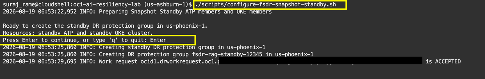

    After you press **Enter** and the work request completes, the standby DR protection group is created and the standby ATP and OKE cluster are added as members.

    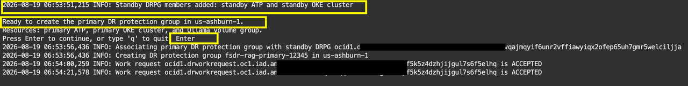

    After you press **Enter** and the work request completes, the primary DR protection group is created, associated with the standby group, and populated with the primary ATP, OKE cluster, and Ollama volume group. The script then pauses again before creating the three DR plans.

    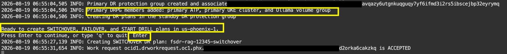

    Press **Enter** to start creating the Switchover, Failover, and Start Drill plans. Plan creation takes approximately **7–8 minutes**. While the plans are being created, continue to **Task 2: Monitor the Configuration in the OCI Console**. Keep the Ashburn Cloud Shell tab open.

    When the script finishes, return to Task 1. Confirm that it returns to the shell prompt and displays the OCIDs for the primary and standby protection groups and the three DR plans. The complete configuration takes approximately 10 minutes, excluding time spent at the confirmation prompts.

    A successful run displays the OCIDs for the primary and standby protection groups and the three plans, then returns to the shell prompt.

    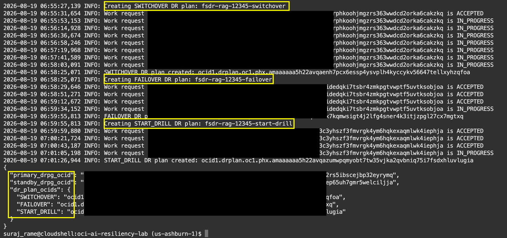

## Task 2: Monitor the Configuration in the OCI Console

1. While the script runs, open two additional OCI Console tabs. Set one to **Ashburn** and the other to **Phoenix**. Keep the Ashburn Cloud Shell tab open. In each Console tab, select **Migration & Recovery**, then **Recovery**, and then **Disaster Recovery**.

2. In both OCI Console tabs, change to the compartment assigned to you. Expand the root compartment, select **Livelabs**, and then select your assigned compartment.

3. Open **DR Protection groups** in each Console tab and monitor the pages as the primary and standby protection groups are created. Refresh the Console tabs periodically if the resources do not appear immediately; do not refresh the Cloud Shell tab. Verify the region-specific names:

    - **Ashburn:** `fsdr-rag-primary-xxxxx`
    - **Phoenix:** `fsdr-rag-standby-xxxxx`

    The `xxxxx` suffix is generated for your environment and may differ from the examples.

    Verify the protection group roles. The `fsdr-rag-primary-xxxxx` protection group shows the **Primary** role, and the `fsdr-rag-standby-xxxxx` protection group shows the **Standby** role.

    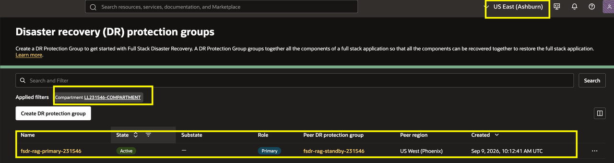

    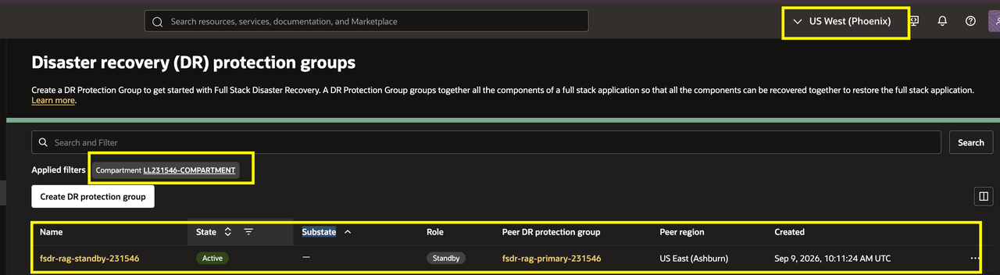

4. As the configuration progresses, verify that the protection groups contain the expected AI workload resources as members.

    - In the Ashburn region, select `fsdr-rag-primary-xxxxx` and open the **Members** tab. Confirm that it contains the primary OKE cluster, primary ATP, and Ollama block volume group.

    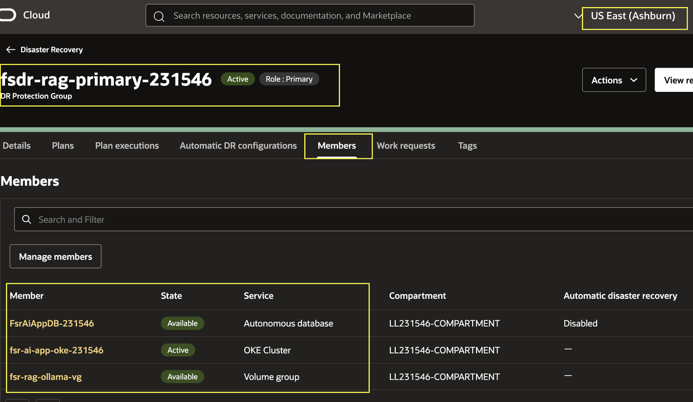

    - In the Phoenix region, select `fsdr-rag-standby-xxxxx` and open the **Members** tab. Confirm that it contains the standby OKE cluster and standby ATP.

    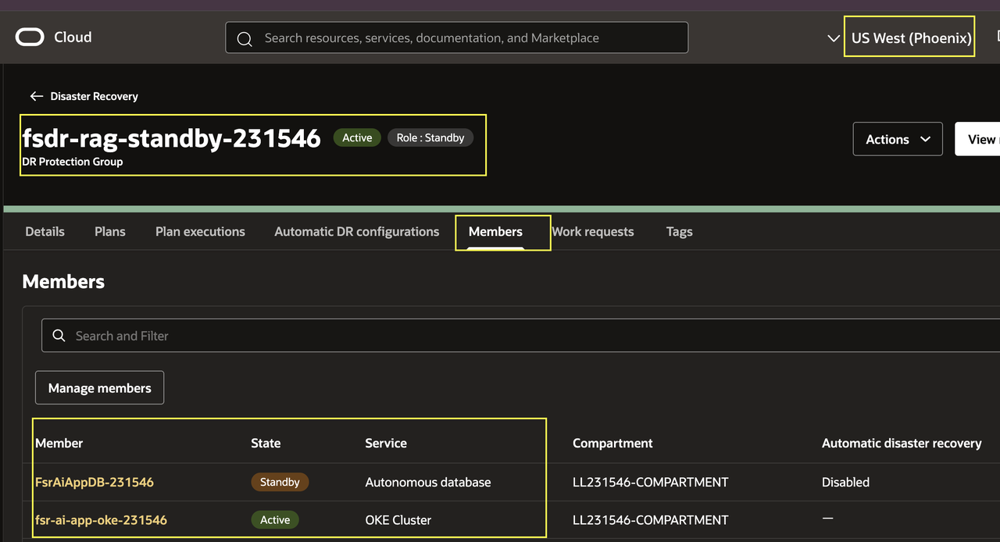

5. After you confirm successful completion in the Ashburn Cloud Shell, use the Phoenix Console tab to open the plans for the **standby DR protection group**. Confirm that the following plans are available:

    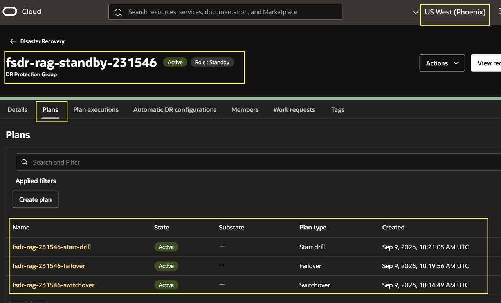

    **Expected recovery plans**

    | Plan type | Plan name |
    | --- | --- |
    | Switchover | `fsdr-rag-xxxxx-switchover` |
    | Failover | `fsdr-rag-xxxxx-failover` |
    | Start Drill | `fsdr-rag-xxxxx-start-drill` |

    The `xxxxx` portion is generated for your environment and may differ from the example.

6. Open each plan and review its task groups. Expand the groups to understand the order of operations. Do not start or execute a plan.

    A plan group is an ordered collection of recovery tasks that Full Stack DR executes as part of a plan. Full Stack DR creates the plans in the standby DR protection group. You can create plans, run plan prechecks, and execute plans only from the standby DR protection group.

    Each plan group contains individual plan steps. Full Stack DR generates these steps from the members and dependencies added to the DR protection group, so the steps can differ between environments.

    At a high level, expect the following plan types and task categories:

    | Plan type | Purpose | Expected task categories |
    | --- | --- | --- |
    | **Switchover** | Planned transition from the Ashburn primary environment to the Phoenix standby environment. | Prechecks, database and application role transitions, OKE and storage operations, and post-transition validation. |
    | **Failover** | Recovery when the Ashburn primary environment is unavailable. | Recovery prechecks, standby activation, application and database recovery, OKE and storage operations, and validation. |
    | **Start Drill** | Test the recovery workflow without changing the production role of the application. | Prechecks, drill-specific database and application operations, OKE and storage actions, and application validation. |

    The following console views show the task groups generated for each plan type:

    **Switchover plan**

    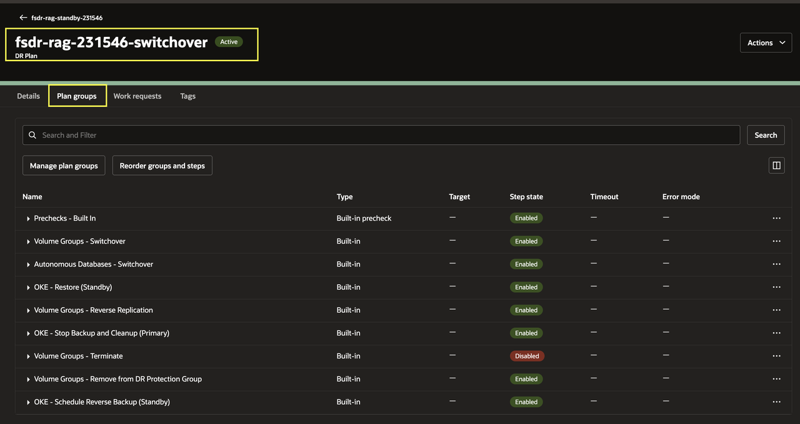

    **Failover plan**

    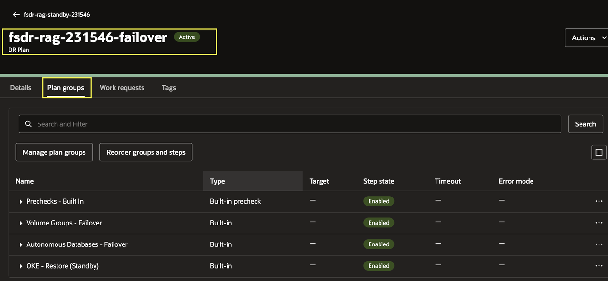

    **Start Drill plan**

    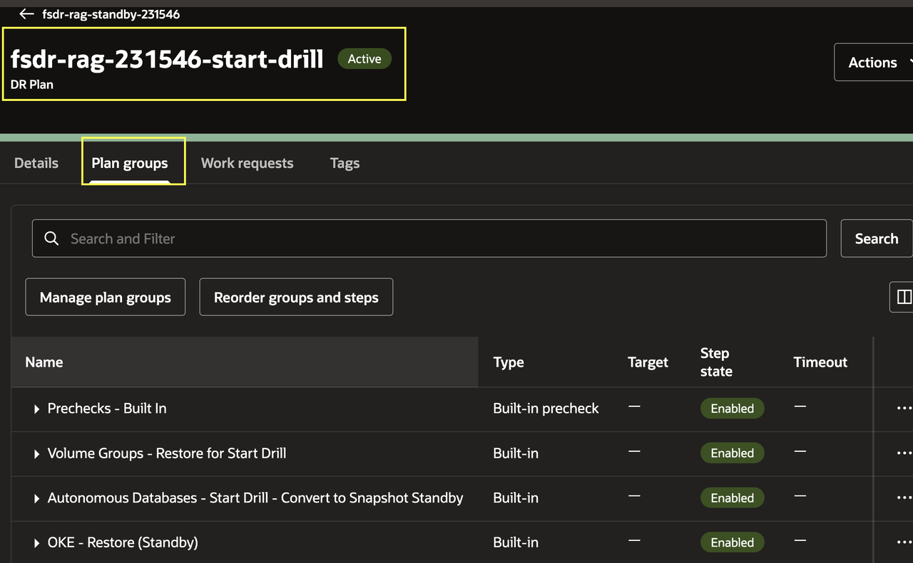


    > **Workshop execution note:** We will run the **Start Drill** plan as part of this workshop in **Lab 3**. Do not execute it in Lab 2.

    > ---

    > **Stop Drill note:** After the **Start Drill** plan completes successfully, Full Stack DR allows you to create a **Stop Drill** plan to end the drill and restore the environment. Creating or running a **Stop Drill** plan is not part of this workshop.

    > ---

    > **DR Protection group role note:** Executing a successful **Switchover** or **Failover** plan changes the roles of the DR protection groups. After the role change, you can create Switchover and Failover plans in the new standby DR protection group. Executing a **Start Drill** or **Stop Drill** plan does not change the roles of the DR protection groups.

    Do not click **Start**, **Execute**, or **Run Prechecks** for any plan in Lab 2. The **Start Drill** plan is executed in Lab 3.

In Lab 3, you will run prechecks and execute the **Start Drill** plan, then monitor the drill execution until it succeeds.

You may now [proceed to the next lab](#next).

## Acknowledgements

* **Author** - Suraj Ramesh, Lead Principal Product Manager, Oracle Database High Availability (HA), Scalability and Maximum Availability Architecture (MAA)
* **Last Updated By/Date** - August 2026
