# Lab 1: Deploy and Validate the Cloud-Native AI Workload in Primary Region OKE Cluster

## Introduction

Deploy the AI document application in the primary OKE cluster. Verify its components before configuring disaster recovery.

**Before you begin**

Complete the workshop introduction. Confirm your OCI credentials, compartment, and region information.

- **Primary region:** Ashburn (`us-ashburn-1`)
- **Standby region:** Phoenix (`us-phoenix-1`)

Run all commands from Cloud Shell in the Ashburn region. Do not use a local terminal or Cloud Shell in another region.

The application runs in the Kubernetes namespace `ai-fsdr-lab`. Use `-n ai-fsdr-lab` with `kubectl` commands throughout the workshop.

Estimated Time: 15 minutes

### Objectives

In this lab, you will:

- Deploy the application to the primary region.
- Confirm that the application components are running.
- Start cross-region replication for the application block volume.
- Use the application to submit a question and upload a document.

## Task 1: Gather the Database OCID and Download the Package

1. Sign in to the OCI Console with the credentials provided with the lab environment.
    
    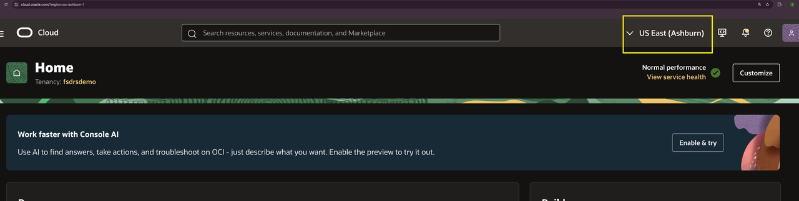

2. In the OCI Console, open the navigation menu. Select **Oracle AI Database**, then **Autonomous AI Database**.

    **Compartment:** Select the compartment assigned to you.

    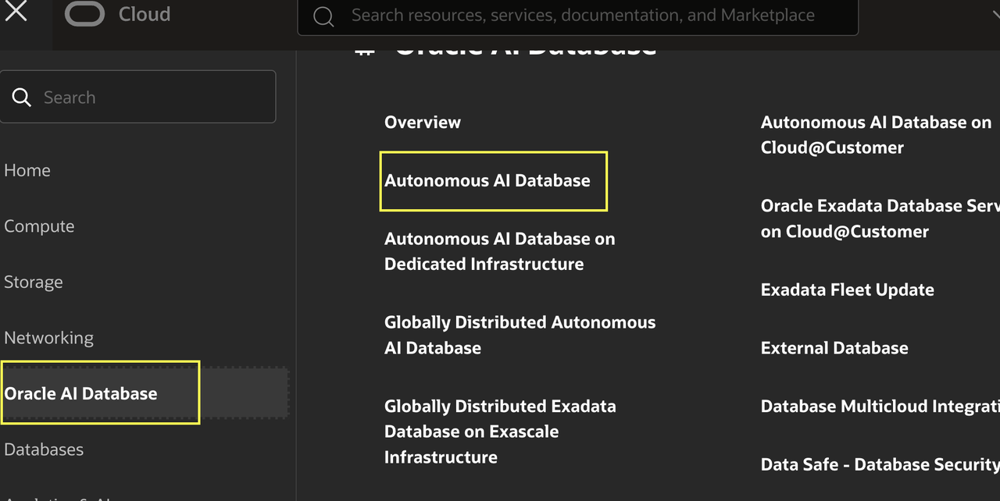

    Select the compartment (**LLxxxxx-COMPARTMENT**) shown in the lab instructions. You can verify it with **View Login Info** at the top left of the instructions page. **LLxxxxx** is the user name used to sign in to the OCI Console.

    Expand the root compartment and then select the **Livelabs** compartment. Under **Livelabs**, select the compartment assigned to you.
    
    **Expected result:** You should see an Autonomous Transaction Processing (ATP) database. In this workshop, **ATP** refers to the Autonomous AI Database used by the application. If you do not see one, verify the compartment. Its name should resemble **FsrRagDB-XXXXX**.

    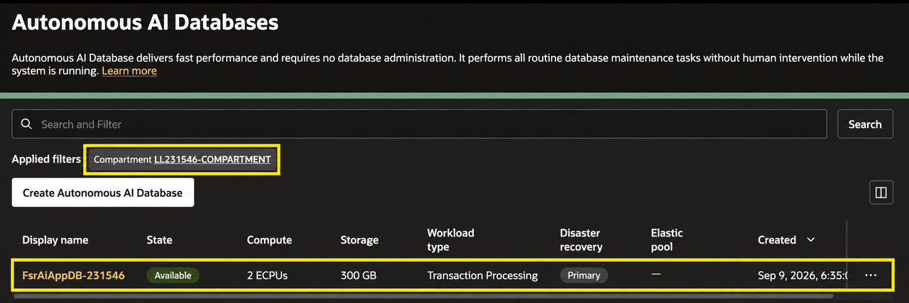

    Open the three-dot menu (...) beside the ATP database. Select the option to copy the ATP OCID, then save it for the next step.

    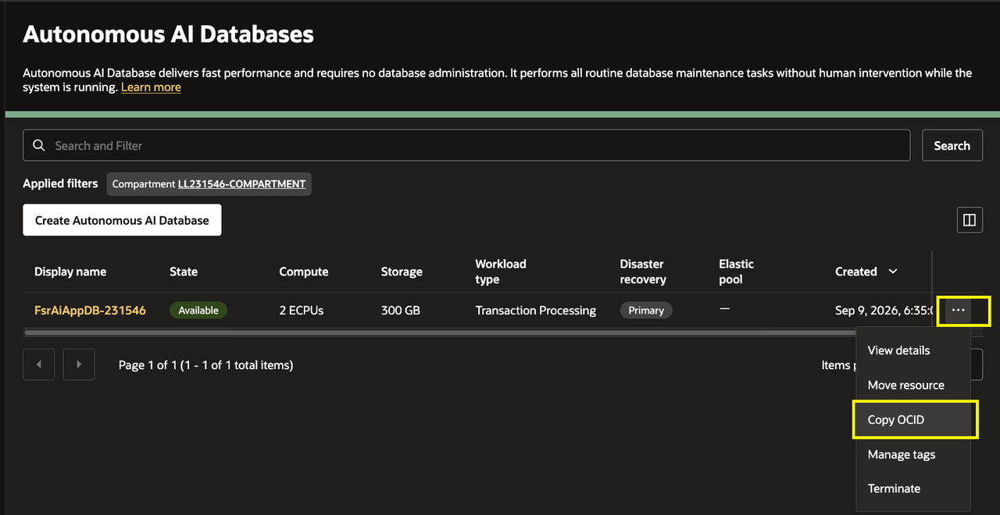


3. Open **Cloud Shell** using the Developer tools (computer) icon next to **Ashburn**. Keep this session open for the remaining commands.

    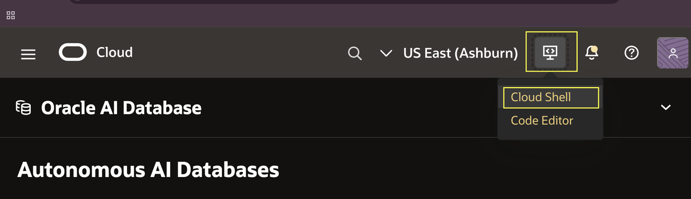

    Cloud Shell home directory opens after a few seconds and displays the prompt. If the tutorial appears, enter **N** to close it.

    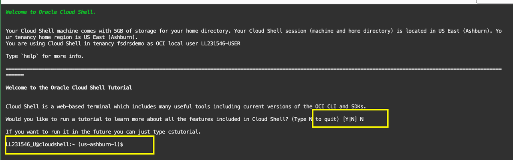

4. Download the application package from the Object Storage URL provided with the lab environment.

    **Ashburn Cloud Shell**

    ```bash
    <copy>
    wget -O oci-ai-resiliency-lab.zip 'https://idfwhcj05ugj.objectstorage.us-ashburn-1.oci.customer-oci.com/p/dIx74t1ht57X3smpT37SmYRdq8ohGV7bGjZxwjFgkCVd0QdOjsdI-wwNkVO_sgjX/n/idfwhcj05ugj/b/fsdrs/o/oci-ai-resiliency-lab.zip'
    </copy>
    ```
    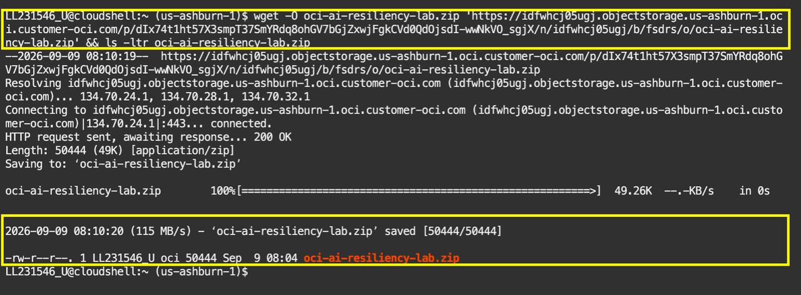

5. Extract the package and enter its directory.

    **Ashburn Cloud Shell**

    ```bash
    <copy>
    unzip oci-ai-resiliency-lab.zip && cd oci-ai-resiliency-lab && chmod +x bootstrap-ai-fsdr-lab.sh deploy.sh destroy.sh
    </copy>
    ```
    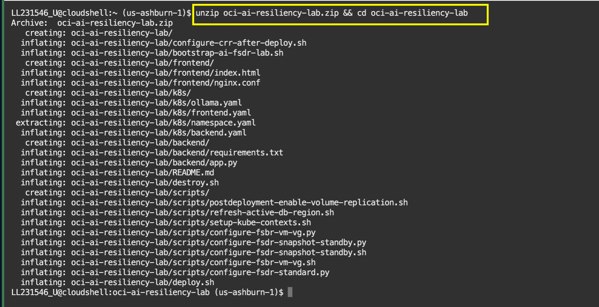

## Task 2: Deploy the Application and Configure Replication

1. Run the deployment script.

    In the Ashburn Cloud Shell, run:

    ```bash
    <copy>
    ./bootstrap-ai-fsdr-lab.sh
    </copy>
    ```

    When prompted, enter these values. Passwords remain hidden. Enter each password twice so the script can catch typing mistakes before deployment begins. Press **Enter** after each value.

    - Database username: `ADMIN`
    - Database password: `AIWorld2026!`
    - Wallet password: `Admin123`
    - Ashburn ATP OCID: the OCID copied in Task 1, Step 2

    Verify each value, then press **Enter**.

    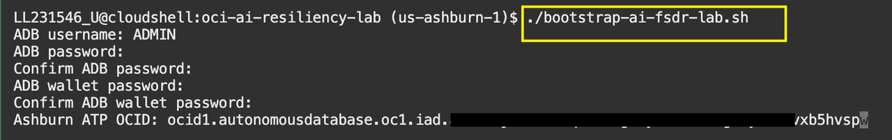

2. Monitor the deployment. It takes approximately 3–4 minutes.

    If deployment fails, the script explains the likely cause and asks whether you want to retry. Choose whether to replace the ADB password, wallet password, or both. The existing Kubernetes resources are reused; cleanup is not required. The script allows up to three attempts. If you stop or use all attempts, verify the ADB username, ADB password, wallet password, selected ATP, and wallet, then rerun `./bootstrap-ai-fsdr-lab.sh`.

    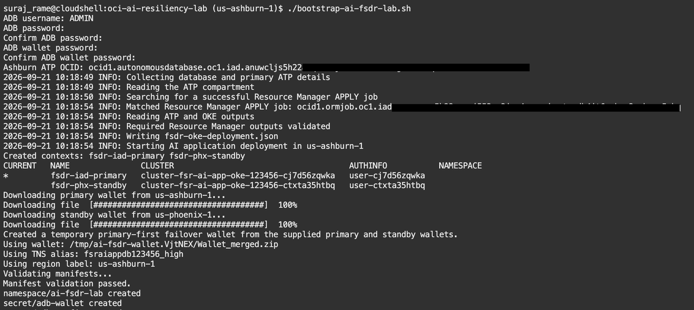

    **Expected result:** The script returns to the shell prompt without an error. If it reports an error, verify the values from Step 1 and rerun the step.

    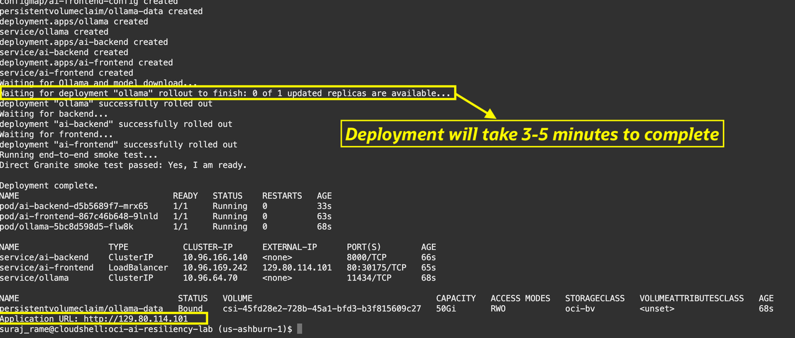

3. Start cross-region replication for the application data volume.

    In the Ashburn Cloud Shell, run:

    ```bash
    <copy>
    ./configure-crr-after-deploy.sh
    </copy>
    ```
    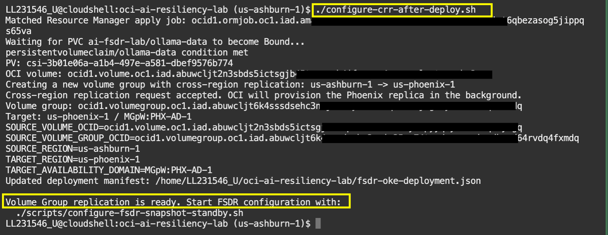


4. Verify that the application resources are running in the `ai-fsdr-lab` namespace. Full Stack DR uses this namespace for the application resources.

    In the Ashburn Cloud Shell, run:

    ```bash
    <copy>
    kubectl -n ai-fsdr-lab get pods,svc,pvc
    </copy>
    ```
    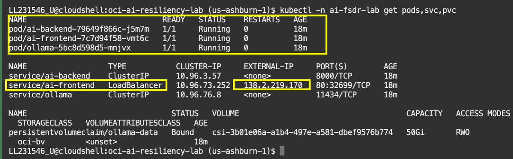

    From the `ai-frontend` service row, copy the **External IP** value. Copy only the IP address; it is the application URL. If no value appears, wait a few moments and run the command again.


## Task 3: Validate the AI Application

1. Open the application URL in a separate browser tab. The URL may take a short time to become reachable after the External IP is assigned.

    In the chat window, enter the following question:

    **What is OCI Full Stack Disaster Recovery?**

    Confirm that the AI inference service returns a response without retrieval-augmented generation (RAG) context. The model should not reference an uploaded document.

    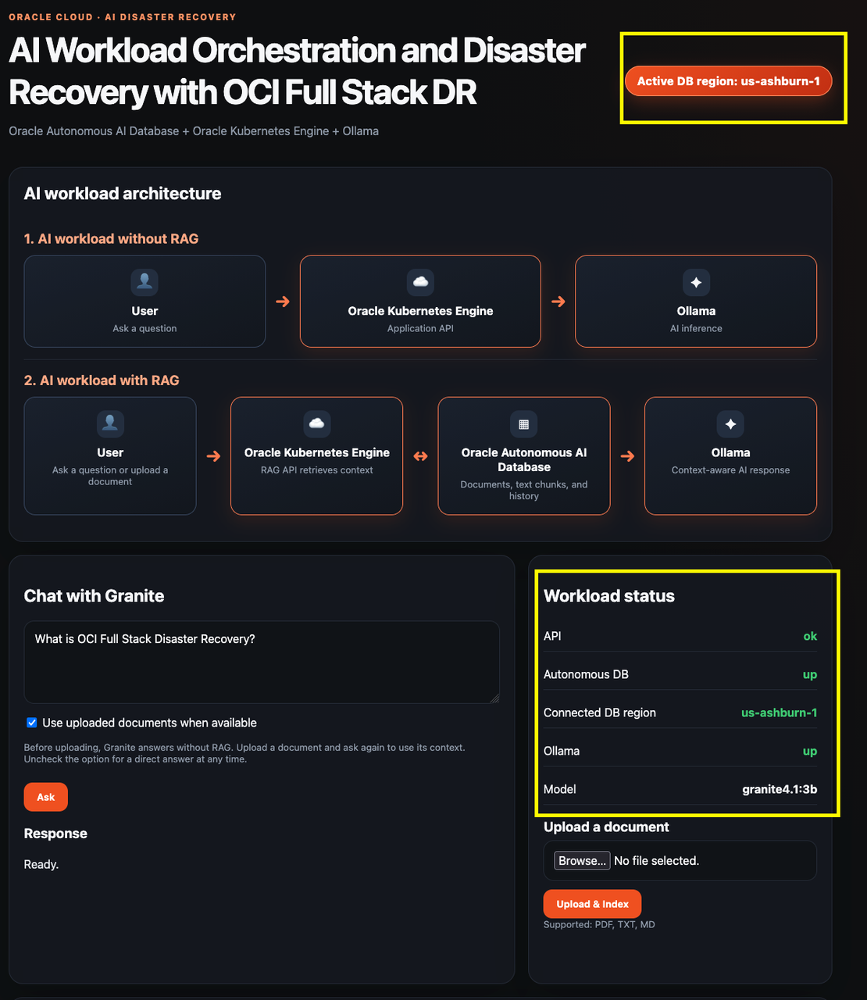

    Confirm that the application shows **Active DB region** and **Connected DB region** as `us-ashburn-1`. Confirm that the API, Autonomous DB, and AI inference service statuses show **ok** or **up**.

    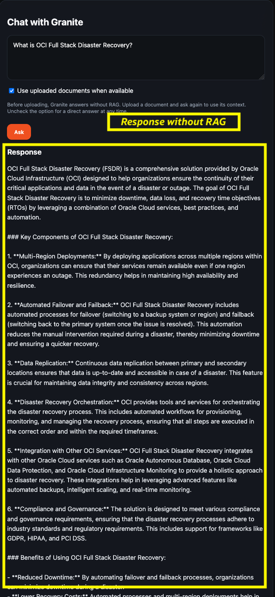

2. Test the document retrieval experience.

    Download the [OCI Full Stack Disaster Recovery official documentation](https://c4u02.objectstorage.us-ashburn-1.oci.customer-oci.com/p/9DEArLjsgbKXuJgQtSG95E8hMXRFtxgHR8jiHbqz4HgyVYXVnSo0SC_s-zq5CJA3/n/c4u02/b/hosted-files/o/OCI%20Full%20Stack%20DR%20doc.pdf) to your local computer, not to Cloud Shell.

    Return to the AI application and upload the PDF. The application processes the document and stores its embeddings as vectors in Oracle AI Database 26ai.

    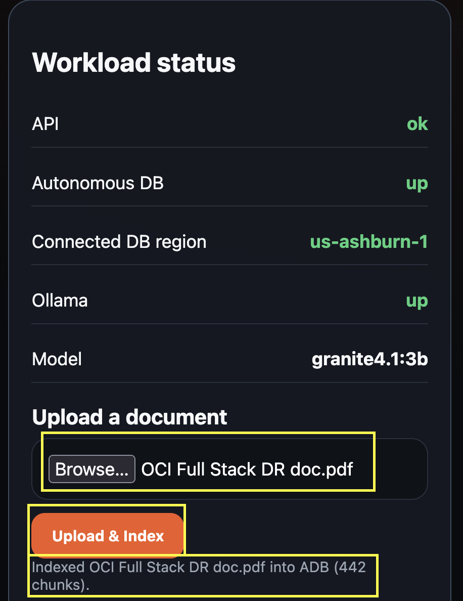
    
3. In the chat window, enter the following question again:

    **What is OCI Full Stack Disaster Recovery?**

    Confirm that the application accepts the document and returns a context-grounded response using RAG from the uploaded documentation. The response should reflect information from the document you uploaded.
    
    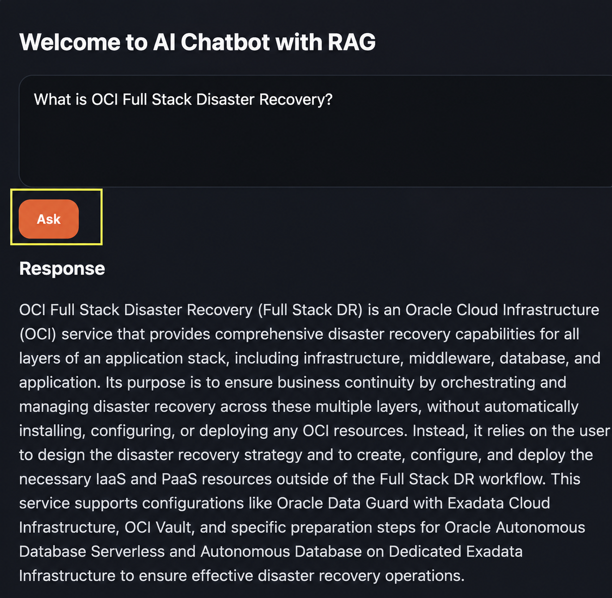

In Lab 2, you will configure OCI Full Stack Disaster Recovery for this AI workload, including the primary and standby DR protection groups and their recovery plans.

You may now [proceed to the next lab](#next).

## Acknowledgements

* **Author** - Suraj Ramesh, Lead Principal Product Manager, Oracle Database High Availability (HA), Scalability and Maximum Availability Architecture (MAA)
* **Last Updated By/Date** - August 2026
