# Lab 3: Execute Prechecks and the Full Stack DR Start Drill Plan

## Introduction

In this lab, run prechecks and execute the Full Stack DR **Start Drill** plan from Lab 2. The drill restores the application in the Phoenix standby region without promoting Phoenix to the production role. Lab 4 validates the recovered application there.

Watch the video below for a quick walk-through of the lab.
[Execute Prechecks and Start Drill](videohub:1_v9tpaggr)

Complete Task 1 and Task 2, Steps 1–4, to start the Start Drill. The drill may take **15–20 minutes**.

While the drill runs, begin Lab 5. When the drill succeeds, pause Lab 5, complete Lab 3, and finish Lab 4. Then resume Lab 5 from where you stopped.

**Before you begin:** Complete Lab 2 and open the Phoenix OCI Console tab.

In this lab, you will run the Start Drill plan prechecks and execution from the standby DR protection group in Phoenix.

The application namespace is `ai-fsdr-lab`. The Start Drill restores the application resources for this namespace in the Phoenix standby OKE cluster.

Estimated Time: 20 minutes

### Objectives

In this lab, you will:

- Run prechecks for the Full Stack DR Start Drill plan.
- Review the precheck results and address any blocking failures.
- Start the drill and monitor the plan execution.

## Task 1: Run Start Drill Plan Prechecks

1. In the Phoenix OCI Console, select your assigned compartment. Open the navigation menu. Select **Migration & Recovery**, then **Recovery**, and then **Disaster Recovery**.

2. Select **DR Protection groups**, open **fsdr-rag-standby-xxxxxx**, and navigate to the **Plans** tab. The `xxxxxx` suffix is unique to your environment.

3. Select **fsdr-rag-xxxxxx-start-drill**. Confirm the **Start Drill** type and the standby DR protection group.

4. Click **Actions**, select **Run prechecks**, and confirm the action if the Console prompts you. Wait for the precheck execution to finish.

    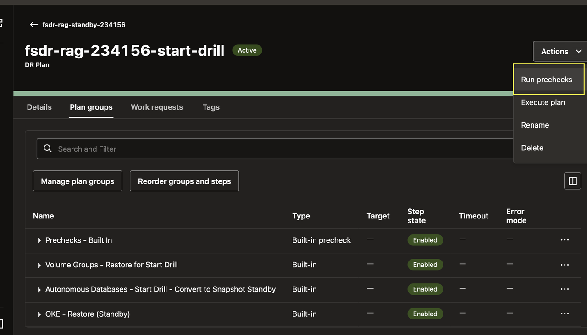

    In the **Run prechecks** dialog, verify the DR plan and **Start drill** type. Leave **Precheck name** blank or enter a name. Keep **Ignore warnings** turned off. Click **Run prechecks**.

    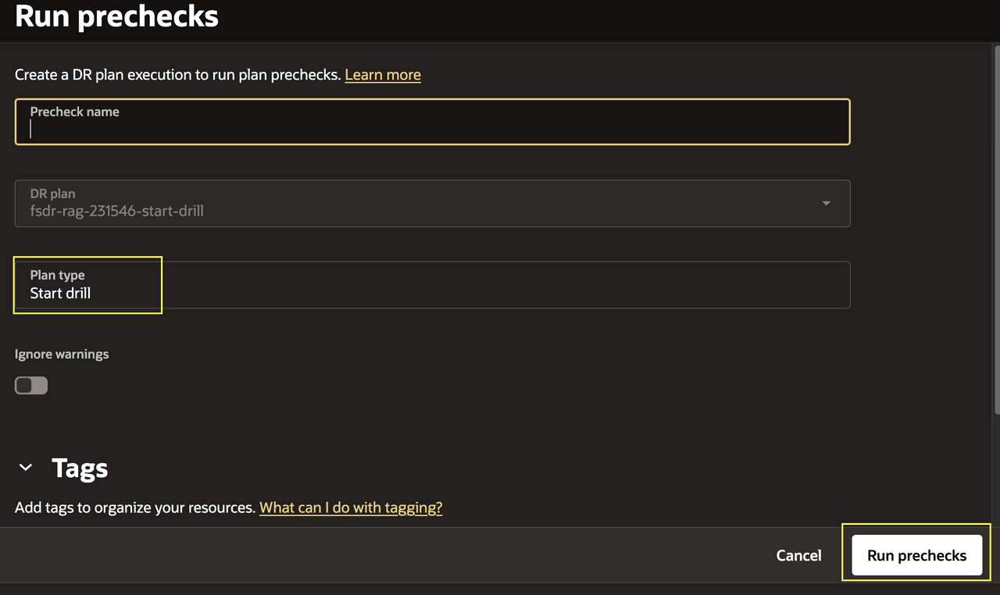

5. Open the precheck execution details. Confirm that every precheck succeeds before you start the plan. Expand an entry to view its message, status, and log details.

    The execution page opens on **Plan execution groups**. Review the precheck group and tasks, including the Autonomous Database snapshot conversion, OKE restore, and volume group restore checks. Wait for all blocking checks to succeed.

    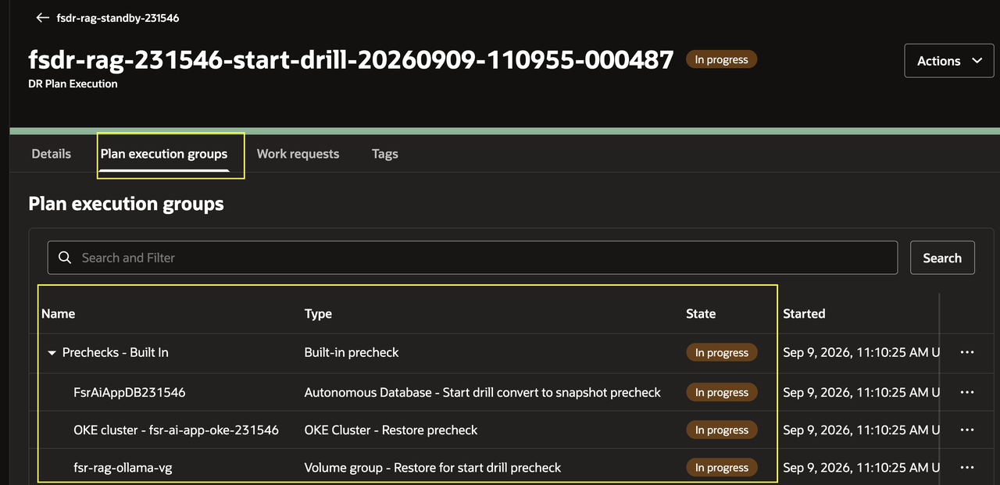

    To view the progress of a plan step, open its **More actions (...)** menu and select **View log**. You can also select **Download log**.

    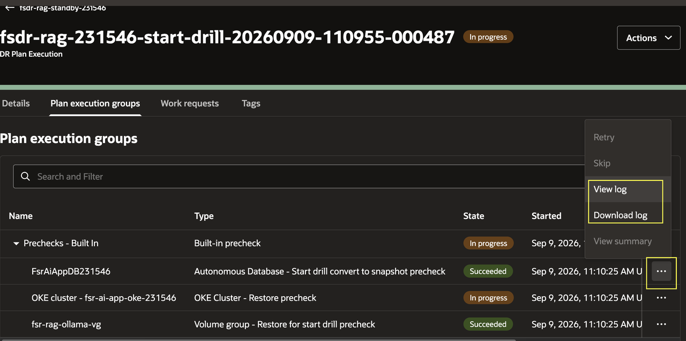

    When the precheck execution finishes, confirm that its status is **Succeeded**. Use this result as the gate for starting the Start Drill plan.

    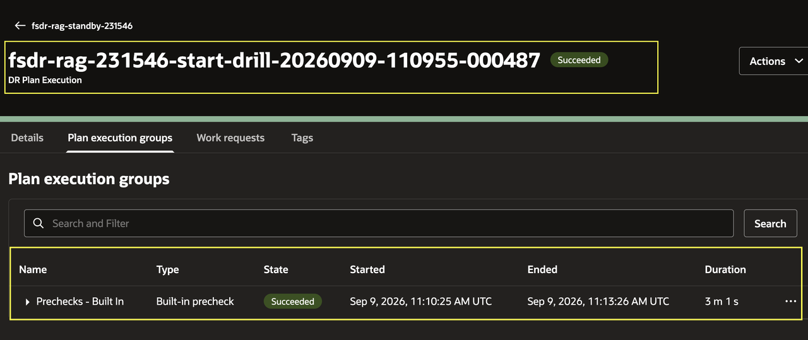

    If a precheck fails, use its message and logs to correct the issue. Typical checks cover member availability, protection-group association, replication, permissions, and resource configuration. Run the prechecks again after resolving the issue. Do not start the plan while a blocking precheck fails.

## Task 2: Execute and Monitor the Start Drill Plan

The Start Drill tests recovery in Phoenix without changing the production role. It restores the standby database, OKE application, storage, and related resources, then runs validation checks. The drill may take approximately **15–20 minutes**.

1. Return to the **fsdr-rag-xxxxxx-start-drill** plan. Open **Actions** and select **Execute plan**.

    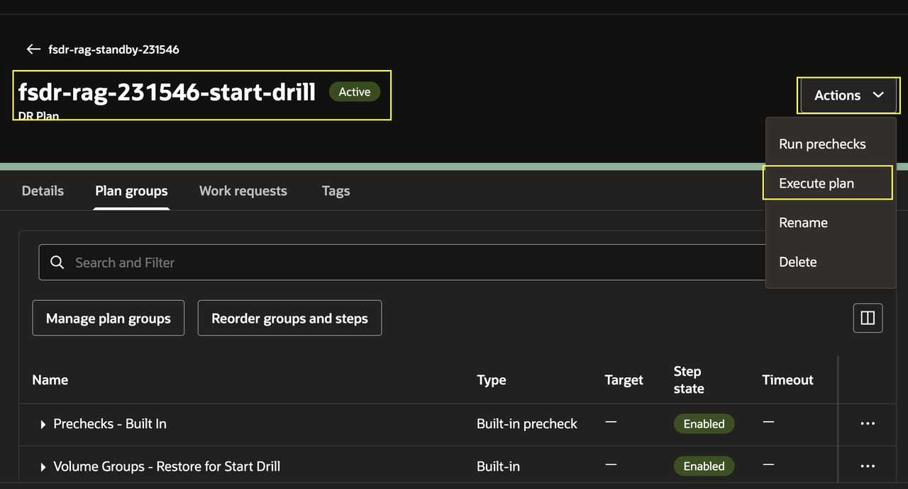

2. In the **Execute plan** dialog, verify the DR plan and **Start drill** type. Leave **Plan execution name** blank. Keep **Enable prechecks** and **Ignore warnings** turned off. Click **Execute plan**.

    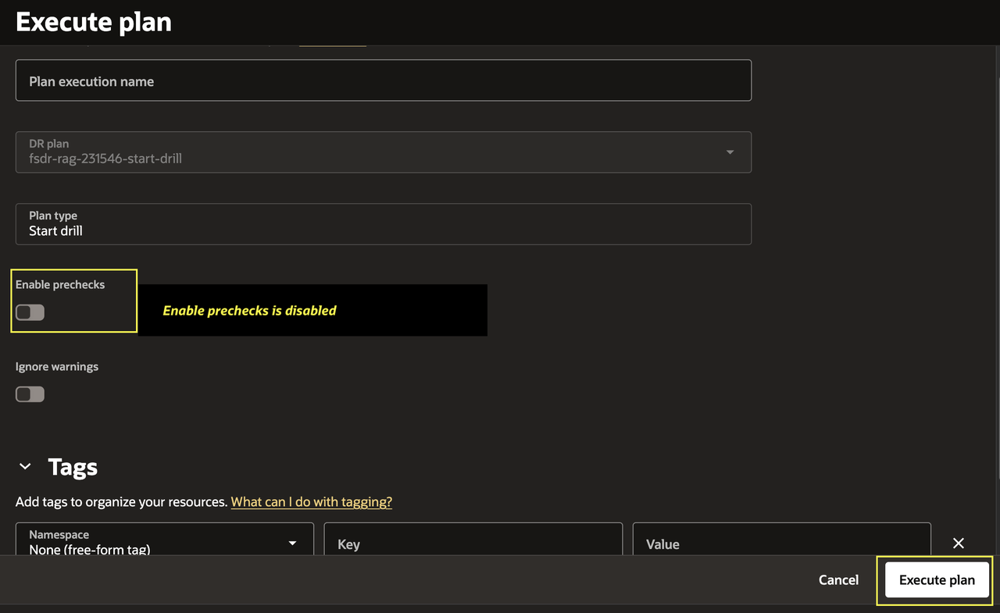

3. Review the warning dialog. Confirm that you understand the risks and click **Execute plan** to start the drill.

    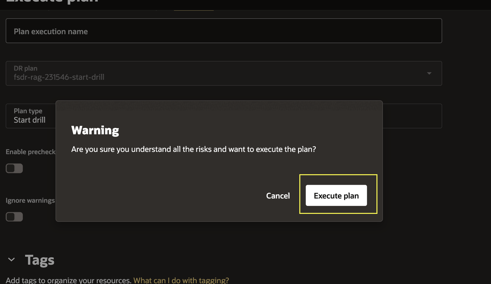

4. Open the plan execution created by the Start Drill operation. Select **Plan execution groups** and monitor the execution as it runs. The execution page shows plan groups and their tasks in run order.

    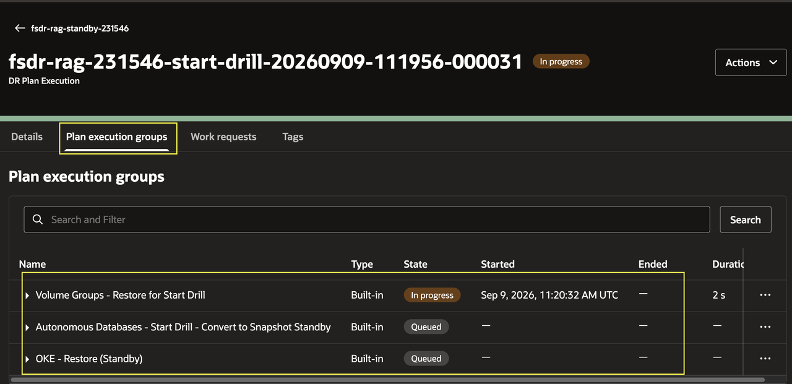

    Expand each plan execution group to review its child tasks. Full Stack DR runs the volume group restore, Autonomous Database snapshot standby conversion, and OKE standby restore tasks in sequence. A completed group shows **Succeeded**; queued or in-progress groups continue to update.

    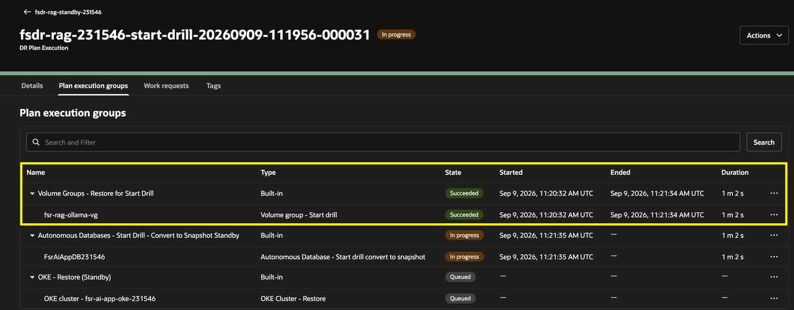

    **Note:** Any plan group can take additional time to complete. This is expected. Based on the member and task type in each plan group, Full Stack DR invokes the corresponding underlying service API and waits for that operation to finish before continuing. For example, the **Autonomous Databases - Start Drill - Convert to Snapshot Standby** task invokes the Autonomous Database APIs and may take several minutes. In this example, the operation completed in approximately 18 minutes, but it may sometimes complete in 5–8 minutes. To check detailed progress for a service operation, open the relevant task and review its **Work requests** details when available. Use the work request status and messages to monitor progress and check for errors. Wait for the task to show **Succeeded** before expecting the next plan group to proceed.

    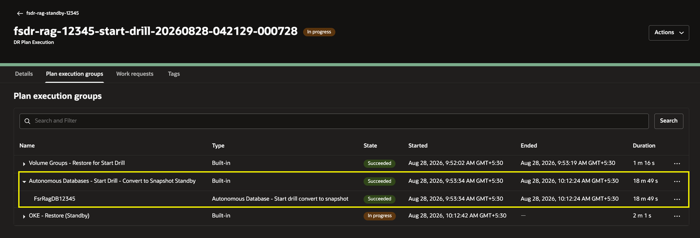

    **While the drill runs, work on [Lab 5: Configure and Execute Full Stack Backup Recovery](?lab=configure-backup-recovery) in a separate browser tab using the Ashburn Cloud Shell.** Keep the Phoenix drill execution open and check its status between Lab 5 steps.

    **When the drill shows Succeeded, pause Lab 5.** Note your current task and step, leave running operations open, and return here to complete Steps 5–8. Then finish Lab 4 and resume Lab 5. If the drill fails, return here to investigate. Do not start Lab 4 until the drill succeeds.

5. Continue expanding plan groups as they run. Monitor each task state and review any warning, failure, or skipped task before you retry or change configuration.

6. Wait until the plan execution status changes to **Succeeded**. Verify that the Start Drill plan has three successful plan groups, with no pending, warning, failed, or skipped steps.

    Open **Plan execution groups** and confirm that the volume group restore, Autonomous Database snapshot standby conversion, and OKE standby restore groups and child tasks all show **Succeeded**.

    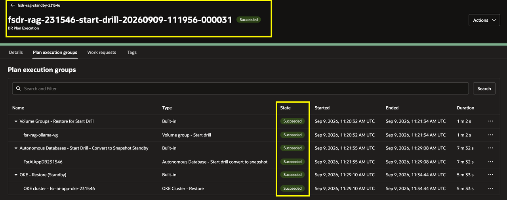

    After you confirm the successful groups, open the **Details** tab and review the overall execution duration.

    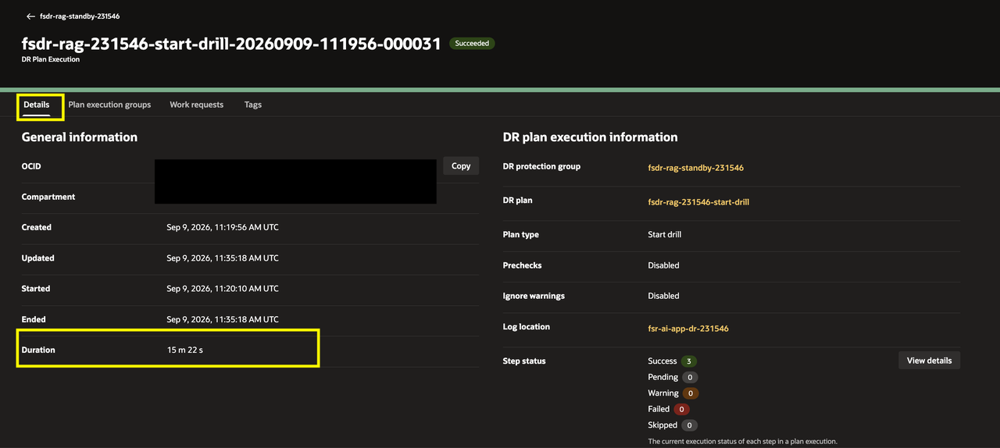

    In this example, the execution took approximately 16 minutes. Treat this as an observation, not a guarantee. Execution time varies with service state and workload. Full Stack DR coordinates the underlying service APIs but does not directly control the Recovery Time Objective (RTO). For the Recovery Point Objective (RPO), consult the guidance for each service. Replication lag, snapshot timing, and backup policies determine data currency.

7. Return to the standby DR protection group and confirm that its header shows **Inactive (Drill in progress)** and **Role: Standby**. On the **Plans** tab, confirm that the Start Drill, Failover, and Switchover plans show **Inactive** while the drill remains active.

    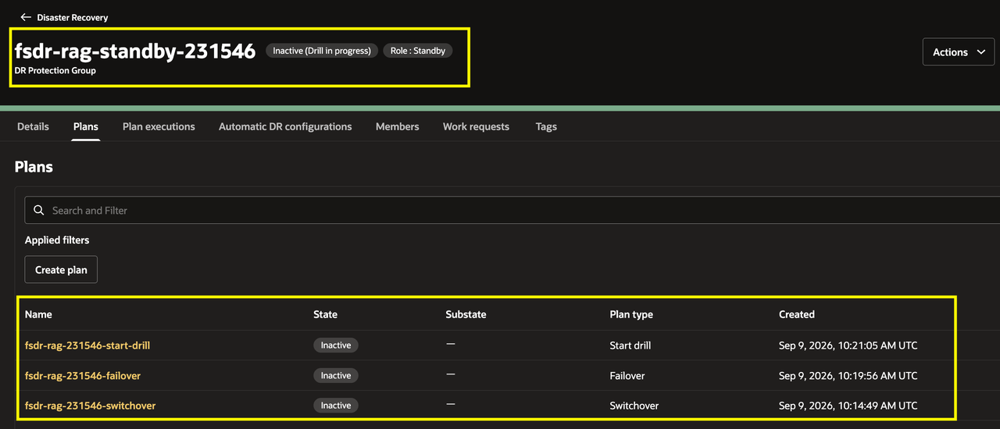

    **Expected result:** The application has been restored in the Phoenix standby OKE cluster. The standby Autonomous Database has been converted to the **Snapshot Standby** role so it can accept connections from the recovered application during the drill. The Phoenix environment is ready for validation in Lab 4; it has not been promoted to the production role.

8. After the Start Drill succeeds, you can create and run a **Stop Drill** plan to convert the application stack back to its state before the drill. Creating or running a Stop Drill plan is outside the scope of this workshop; leave the drill active for Lab 4.

    A successful **Switchover** or **Failover** plan changes the role of the DR protection group. A **Start Drill** does not change that role; it keeps the protection group in its standby role while the drill runs.

    In Lab 4, you will validate the AI application in the Phoenix region while the Start Drill remains active, including its frontend, backend, database connection, and RAG response.

    You may now [proceed to the next lab](#next).

## Acknowledgements

* **Author** - Suraj Ramesh, Lead Principal Product Manager, Oracle Database High Availability (HA), Scalability and Maximum Availability Architecture (MAA)
* **Last Updated By/Date** - September 2026
