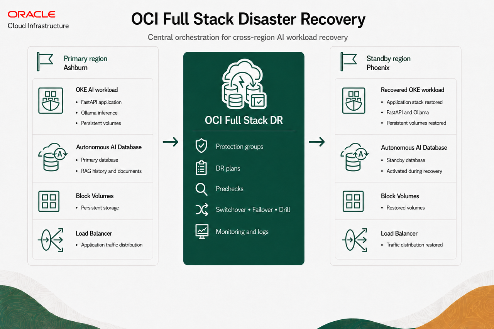
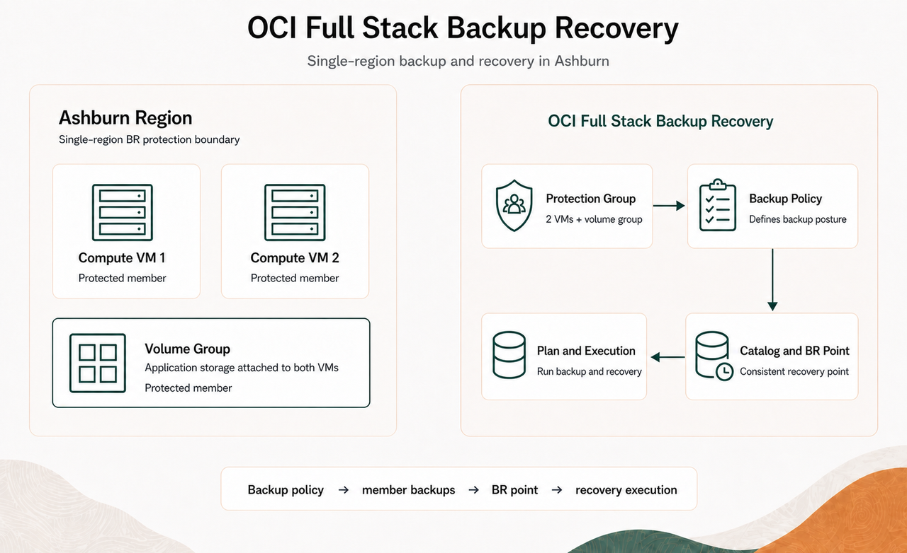

# Introduction

## About the Workshop

In this workshop, you learn how Oracle Cloud Infrastructure (OCI) Full Stack Disaster Recovery (DR) and OCI Full Stack Backup Recovery (BR) protect and recover different parts of a resilient AI environment.

The workload is an AI Retrieval-Augmented Generation (RAG) application deployed on Oracle Kubernetes Engine (OKE). It includes a web frontend, FastAPI backend, Ollama model service, persistent application storage, and Oracle Autonomous AI Database connectivity.

The workshop focuses on resiliency services rather than application development. You will first deploy the supplied AI workload, then complete two related tracks.

### Workshop Tracks

- **OCI Full Stack DR:** Protect the OKE application and Autonomous AI Database across the Ashburn primary region and Phoenix standby region. Configure DR protection groups and plans, execute a Start Drill Plan, and validate the recovered AI application in Phoenix.
- **OCI Full Stack BR:** Protect two OCI compute virtual machines and their shared volume group in Ashburn. Configure the BR protection group and backup policy, create a catalog and BR point, and run a backup and recovery plan.

Together, these tracks demonstrate cross-region application DR orchestration with Full Stack DR and single-region backup and recovery orchestration with Full Stack BR.

## Task 1: Service Overview

### OCI Full Stack Disaster Recovery

OCI Full Stack DR orchestrates the transition of compute, database, and applications between OCI regions from around the globe with a single click. Customers can automate the steps needed to recover one or more business systems without redesigning or re-architecting existing infrastructure, databases, or applications and without specialized management or conversion servers.

Full Stack DR can coordinate a broad set of OCI services that make up an application stack. The main supported resource types include:

- **Compute Instances**
- **Load Balancers**
- **Network Load Balancers**
- **Boot and Block Volumes (Volume Groups)**
- **File Systems**
- **Object storage buckets**
- **Oracle Exadata Database Service**
- **Oracle Exadata Cloud@Customer**
- **Oracle Exadata Database Service on Dedicated Infrastructure**
- **Oracle Autonomous Database on Exadata Cloud@Customer**
- **Oracle Base Database Service**
- **Oracle Autonomous Database Serverless**
- **Oracle Autonomous Database on Dedicated Exadata Infrastructure**
- **MySQL DB System (MySQL HeatWave)**
- **Integration Instance (Oracle Integration)**

Full Stack DR brings these service-specific recovery operations together into ordered plans with dependencies, prechecks, execution logs, and post-recovery validation. Each service's native replication, backup, or standby technology must be configured separately.

In this workshop, Full Stack DR uses replication, prechecks, plans, and execution monitoring to recover the OKE application and Autonomous AI Database from Ashburn to Phoenix. You will execute a Start Drill Plan and validate the recovered application.

### Full Stack Backup Recovery

OCI Full Stack BR provides coordinated backup and recovery for OCI resources within one region. It protects infrastructure state, backup configuration, member backups, and BR points that assemble consistent recovery points.

In this workshop, Full Stack BR protects two Ashburn compute virtual machines and their shared volume group. You will configure the BR protection group and policy, review the catalog and BR point, and run a backup and recovery plan.

### How the Services Work Together

Full Stack DR handles cross-region application recovery for DR. Full Stack BR handles regional backup and recovery for compute and storage. Together, they support a complete resiliency process:

- **Know** the resources, dependencies, regions, and recovery readiness of the application.
- **Protect** application data, volumes, database services, and Kubernetes resources.
- **Recover** the protected stack through tested and repeatable plans.
- **Prove** recovery by validating application health, AI responses, document access, and database persistence.

### Benefits of the Services

OCI Full Stack DR and BR help organizations:

- Coordinate recovery for the full application stack.
- Reduce recovery time through repeatable operational steps.
- Use service-level plans, prechecks, logs, and monitoring.
- Protect the infrastructure and data required by AI workloads.
- Customize recovery plans with application-specific validation.
- Test recovery readiness through drills before a real outage.

Estimated Workshop Time: 90 minutes

## Task 2: Workshop Architecture

The workshop uses a primary OKE and Autonomous AI Database environment in one OCI region and a standby recovery environment in a second OCI region. Autonomous Data Guard protects the Autonomous AI Database, and cross-region volume replication protects the Ollama persistent volume. Full Stack DR coordinates the application, storage, database, and validation workflow. BR provides regional backup and recovery for protected compute and volume resources.

### Full Stack Disaster Recovery

### Full Stack Backup Recovery

## Task 3: Environment Details

- The primary and standby region names are supplied by the workshop environment. We will start with Primary region as `Ashburn` and Standby region as `Phoenix`.
- The bootstrap script creates the `fsdr-iad-primary` and `fsdr-phx-standby` Kubernetes contexts.
- The application package validates the frontend, backend, Ollama model service, and Autonomous AI Database connection.
- The workshop configures cross-region replication before creating the Full Stack DR protection groups and plans.
- The Full Stack BR service will use the compute instances and configure backup, recovery catalog point and run backup, recovery plans.

### Pre-provisioned Resources

The workshop environment includes the following resources for the two resiliency services:

- **Full Stack DR:** A primary OKE cluster and Autonomous AI Database in the primary region, a standby OKE cluster and Autonomous AI Database in the standby region, and Autonomous Data Guard between the databases. Lab 1 creates and configures the Ollama persistent volume group with cross-region replication.
- **Full Stack BR:** Two compute instances and their shared block volume group in the primary region. These resources are added to a BR protection group for backup and recovery.

## Task 4: Workshop Objectives

- Deploy and validate the cloud-native AI workload.
- Configure the Full Stack DR resources.
- Execute plan prechecks and the Full Stack DR Start Drill plan.
- Monitor DR plan and validate the recovered application.
- Configure Full Stack Backup Recovery protection groups and backup policies.
- Review catalogs and BR points as recovery points.
- Run BR plans and verify their executions.
- Troubleshoot common policy, context, replication, and application validation issues.

## Task 5: Reference Links

[OCI Full Stack Disaster Recovery](https://www.oracle.com/cloud/full-stack-disaster-recovery/)

[OCI Full Stack Disaster Recovery User Guide](https://docs.oracle.com/en-us/iaas/disaster-recovery/index.html)

You may now [Proceed to the next lab](#next)

## Acknowledgements

* **Author** - Suraj Ramesh, Lead Principal Product Manager, Oracle Database High Availability (HA), Scalability and Maximum Availability Architecture (MAA)
* **Last Updated By/Date** - August 2026
