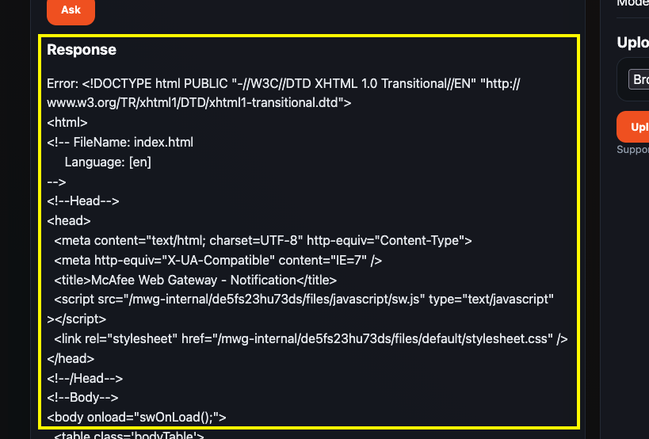

# Lab 4: Execute the Post-DR Script and Validate the App

## Introduction

After the Full Stack DR Start Drill plan completes, run the post-DR script to point the recovered application to Phoenix. Then validate the cloud-native AI workload with the document chunks already in the Phoenix database.

Watch the video below for a quick walk-through of the lab.
[Execute Post-DR Script and Validate the App](videohub:1_jqhuyewg)

Start Lab 4 after the Start Drill succeeds and the remaining Lab 3 checks are complete. Lab 4 depends on the recovered Phoenix environment.

**Before you begin:** Open Cloud Shell in the Phoenix region. The Full Stack DR Start Drill has restored the application in the Phoenix standby environment.

The restored application runs in the `ai-fsdr-lab` namespace on the Phoenix standby OKE cluster. Use `kubectl -n ai-fsdr-lab` for application checks and troubleshooting.

The Full Stack DR document uploaded in Ashburn is already available in Phoenix. Autonomous Data Guard synchronizes the stored document data, including its text chunks. During the drill, the Phoenix snapshot standby accepts application connections. The recovered application uses keyword scoring to retrieve the existing document chunks as context for Granite, without another upload.

Estimated Time: 10 minutes

### Objectives

In this lab, you will:

- Confirm that the Start Drill plan completed successfully.
- Execute the post-DR script for the Phoenix drill environment.
- Validate the cloud-native AI workload with retrieval-augmented generation (RAG).
- Troubleshoot readiness and application errors after plan execution.

## Task 1: Execute the Post-DR Script

1. Open Cloud Shell in the **Phoenix** region. Navigate to the `scripts` directory from the application package downloaded and extracted in Lab 1:

    ```bash
    <copy>
    cd ~/oci-ai-resiliency-lab/scripts
    </copy>
    ```

    If you used a different location in Lab 1, replace the path with the path to that package's `scripts` directory.

2. Set the kubectl context to the Phoenix standby OKE cluster:

    ```bash
    <copy>
    kubectl config use-context fsdr-phx-standby
    kubectl config current-context
    </copy>
    ```

    Confirm that the current context is `fsdr-phx-standby` before continuing.

    

3. Run the post-DR script and confirm it completes successfully with `Active drill region: us-phoenix-1`:

    ```bash
    <copy>
    ./refresh-active-db-region.sh --drill-region us-phoenix-1
    </copy>
    ```

    The script updates the Phoenix application configuration and backend deployment. It then waits for the backend rollout. If it fails, review the error before continuing.

    

4. Retrieve the Phoenix application load balancer IP:

    ```bash
    <copy>
    kubectl -n ai-fsdr-lab get svc ai-frontend
    </copy>
    ```

    Copy the value in the `EXTERNAL-IP` column. Use this IP as the application URL in Task 2. If it is not available, wait a few moments and run the command again.

    

## Task 2: Validate the Cloud-Native AI Workload

1. Open the recovered application URL in a separate browser tab. Use `http://` followed by the `EXTERNAL-IP` value from Task 1, Step 4.

    If the page does not open, confirm that the external IP is no longer `<pending>` and check the service and pod status in the Phoenix Cloud Shell:

    ```bash
    <copy>
    kubectl -n ai-fsdr-lab get svc ai-frontend
    kubectl -n ai-fsdr-lab get pods
    </copy>
    ```

    Wait a few minutes if the load balancer was recently created, then retry the URL. If the page still does not open, clear the browser cache, try a different browser, or open the URL in a private or incognito browser window. Do not continue until the frontend opens.

2. Confirm that the frontend loads. Verify that the API, Autonomous DB, and Ollama statuses show **ok** or **up**, that **Active DB region** and **Connected DB region** show `us-phoenix-1`, and that the model is `granite4.1:3b`.

    Keep **Use uploaded documents when available** checked. In **Chat with Granite**, enter the following question and click **Ask**:

    **What is OCI Full Stack Disaster Recovery?**

    Ask the question without uploading the document again. Allow about a minute for the response on this demo cluster. Confirm that the response is labeled **With RAG — document context used** and that the source filenames and excerpts include the documentation uploaded in Lab 1. This verifies that the recovered application can use the document data in Phoenix.

    

3. If the response displays an error or HTML text like the example below, wait briefly and click **Ask** again to retry the same question. Wait for the retry to finish before submitting another request.

    

    If application validation still fails, inspect Kubernetes events and backend logs. Use the error messages to identify region, policy, protection group, volume replication, wallet, or Kubernetes-context issues.

    ```bash
    kubectl -n ai-fsdr-lab get events --sort-by=.metadata.creationTimestamp
    kubectl -n ai-fsdr-lab logs deployment/ai-backend --tail=100
    ```

## Conclusion

You have completed the OCI Full Stack Disaster Recovery lab. You deployed and validated the AI workload, configured snapshot standby protection, executed a Start Drill, and validated the recovered Phoenix application with RAG.

Now return to [Lab 5: Configure and Execute Full Stack Backup Recovery](?lab=configure-backup-recovery) and resume from the task and step you recorded. Use the Ashburn Cloud Shell. Check the status of any script, backup, or recovery operation you left running before continuing; do not submit it again. If you have not started Lab 5, begin at Task 1. Complete all remaining Lab 5 tasks to finish the workshop.

If you completed Lab 5 while the Start Drill ran, you have finished both workshop tracks. No further lab work is required. The **Next** button opens Lab 5; you do not need to repeat it.

## Acknowledgements

* **Author** - Suraj Ramesh, Lead Principal Product Manager, Oracle Database High Availability (HA), Scalability and Maximum Availability Architecture (MAA)
* **Last Updated By/Date** - September 2026
