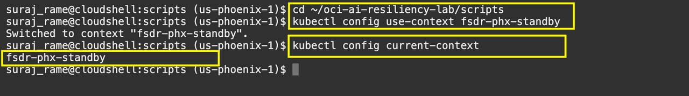
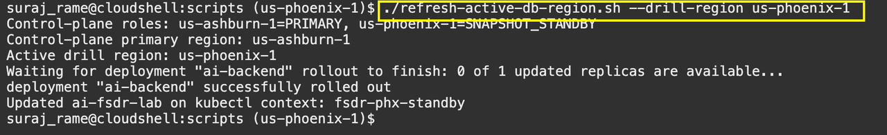
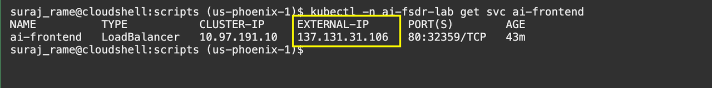
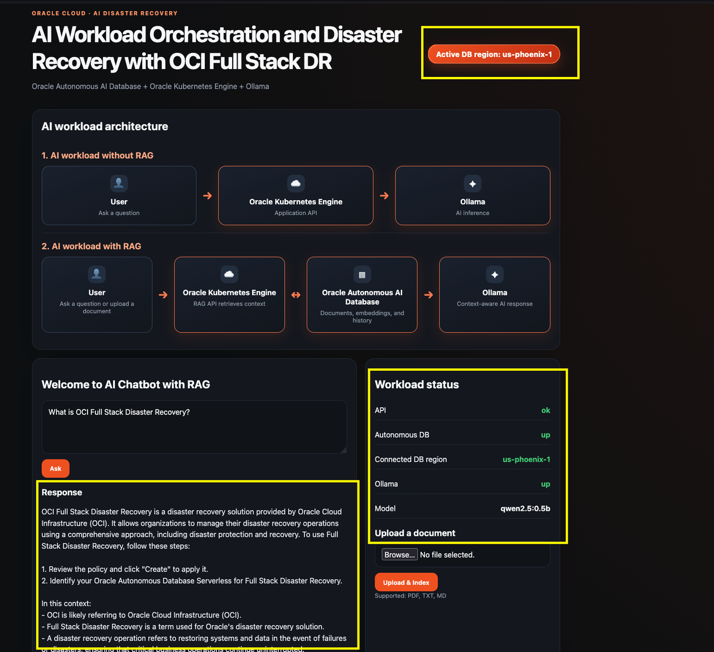

# Lab 4: Execute Post DR Script and Validate the App

## Introduction

After the Full Stack DR Start Drill plan completes, run the post-DR script to point the recovered application to Phoenix. Then validate the cloud-native AI workload with the document chunks already in the Phoenix database.

Complete Lab 3 and wait for the Start Drill plan to finish successfully before starting this lab. Lab 4 depends on the completed Start Drill environment.

**Before you begin:** Open Cloud Shell in the Phoenix region and use the application package from Lab 1.

The restored application runs in the `ai-fsdr-lab` namespace on the Phoenix standby OKE cluster. Use `kubectl -n ai-fsdr-lab` for application checks and troubleshooting.

The FSDR document uploaded in Ashburn is already available in Phoenix. Autonomous Data Guard synchronizes its chunks and embeddings. During the drill, the Phoenix snapshot standby accepts application connections. The recovered application can query the existing RAG data without another upload.

Estimated Time: 10 minutes

### Objectives

In this lab, you will:

- Confirm that the Start Drill plan completed successfully.
- Execute the post-DR script for the Phoenix drill environment.
- Validate the cloud-native AI workload with retrieval-augmented generation (RAG).
- Troubleshoot readiness and application errors after plan execution.

## Task 1: Execute the Post-DR Script

1. Open Cloud Shell in the **Phoenix** region. Navigate to the `scripts` directory from the application package that you extracted in Lab 1:

    ```bash
    <copy>
    cd ~/oci-ai-resiliency-lab/scripts
    </copy>
    ```

    If you used a different location in Lab 1, replace the path with the path to that package's `scripts` directory.

2. Set the kubectl context to the Phoenix standby OKE cluster:

    ```bash
    <copy>
    kubectl config use-context fsdr-phx-standby
    kubectl config current-context
    </copy>
    ```

    Confirm that the current context is `fsdr-phx-standby` before continuing.

    

3. Run the post-DR script and confirm it completes successfully with `Active drill region: us-phoenix-1`:

    ```bash
    <copy>
    ./refresh-active-db-region.sh --drill-region us-phoenix-1
    </copy>
    ```

    The script updates the Phoenix application configuration and backend deployment. It then waits for the backend rollout. If it fails, review the error before continuing.

    

4. Retrieve the Phoenix application load balancer IP:

    ```bash
    <copy>
    kubectl -n ai-fsdr-lab get svc ai-frontend
    </copy>
    ```

    Copy the value in the `EXTERNAL-IP` column. Use this IP as the application URL in Task 2. If it is not available, wait a few moments and run the command again.

    

## Task 2: Validate the Cloud-Native AI Workload

1. Open the recovered application URL in a separate browser tab.

2. Confirm that the frontend loads and that the backend, Phoenix Autonomous AI Database, and Ollama health indicators are available.

    In the chat window, enter:

    **What is OCI Full Stack Disaster Recovery?**

    Confirm that the application returns a response using RAG from the document chunks already present in the Phoenix database.

    

3. If validation fails, inspect Kubernetes events and backend logs. Use the failed task message and log to identify region, policy, protection group, volume replication, wallet, or Kubernetes-context issues.

    ```bash
    kubectl -n ai-fsdr-lab get events --sort-by=.metadata.creationTimestamp
    kubectl -n ai-fsdr-lab logs deployment/ai-backend --tail=100
    ```

## Conclusion

You have completed the OCI Full Stack Disaster Recovery lab. You deployed and validated the AI workload, configured snapshot standby protection, executed a Start Drill, and validated the recovered Phoenix application with RAG.

You may now [proceed to the next lab](#next).

## Acknowledgements

* **Author** - Suraj Ramesh, Lead Principal Product Manager, Oracle Database High Availability (HA), Scalability and Maximum Availability Architecture (MAA)
* **Last Updated By/Date** - August 2026
